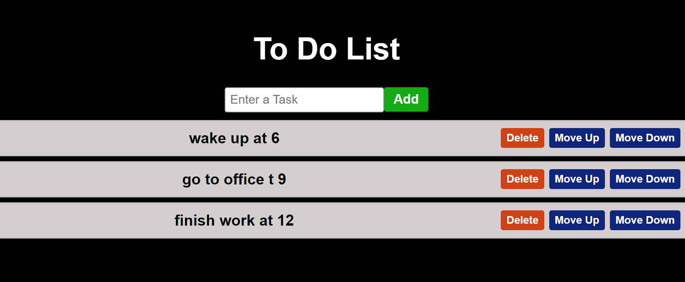

# To-Do List App

A simple **To-Do List** application built using **React**. This app allows users to add, delete, and move tasks up or down in the list.

## 🖼️ Preview  
  

---

## Features

- **Add Task**: Users can enter a task and add it to the list.
- **Delete Task**: Users can delete a task from the list.
- **Move Task Up/Down**: Users can reorder tasks by moving them up or down in the list.
- **Task Management**: Tasks are stored in a React state and persist as long as the page is not reloaded.

## Technologies Used

- **React**: A JavaScript library for building user interfaces.
- **useState Hook**: Used to manage the state of tasks and the input field.
- **CSS**: Used for styling the app.

## Installation

To set up the project locally:

1. Clone the repository to your local machine:
    ```bash
    git clone https://github.com/your-username/todo-list-app.git
    ```

2. Navigate to the project folder:
    ```bash
    cd todo-list-app
    ```

3. Install the dependencies:
    ```bash
    npm install
    ```

4. Run the development server:
    ```bash
    npm run dev
    ```

5. Open your browser and go to [http://localhost:3000](http://localhost:3000) to view the app.

## Usage

1. **Add a task**: Enter a task in the input field and click the "Add" button.
2. **Delete a task**: Click the "Delete" button next to the task to remove it.
3. **Move a task**: Click the "Move Up" or "Move Down" buttons to reorder the tasks.

## Example

Here's what the app looks like:

